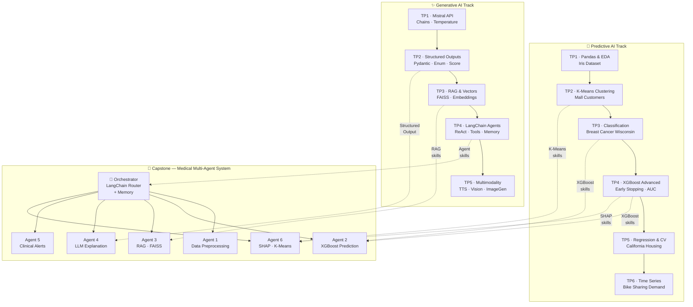
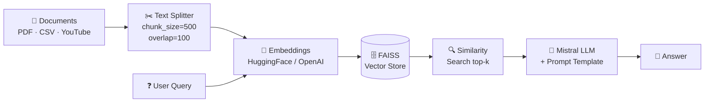
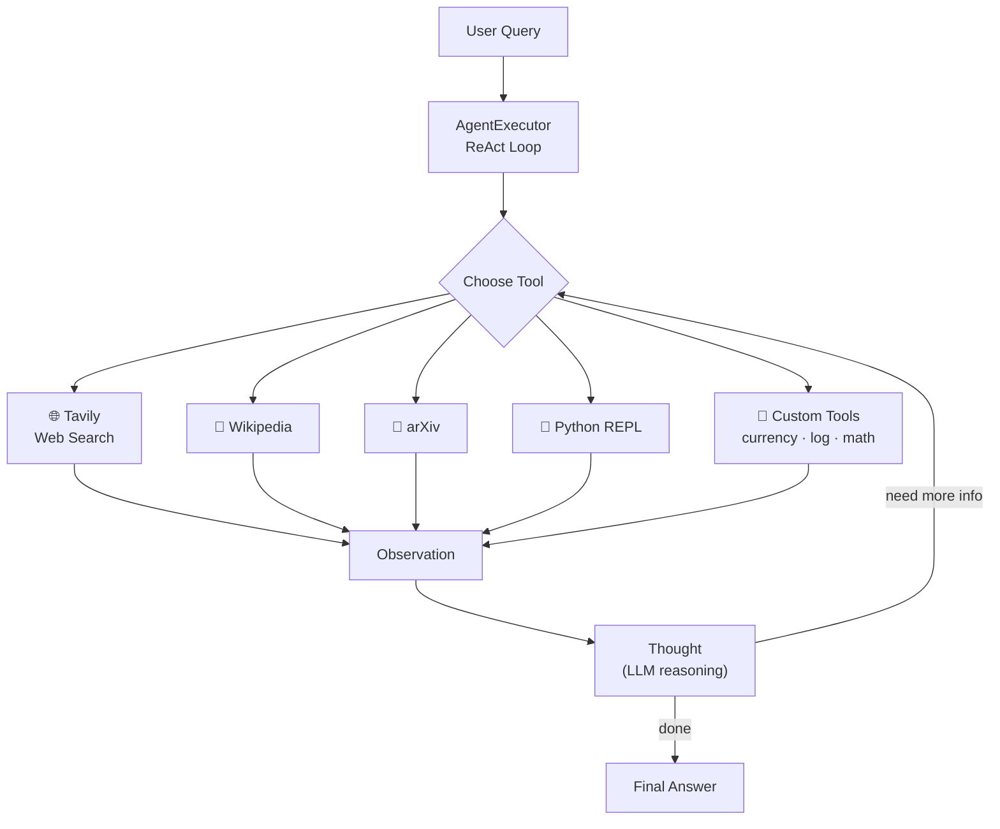
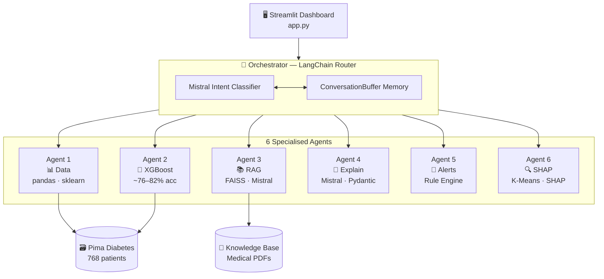
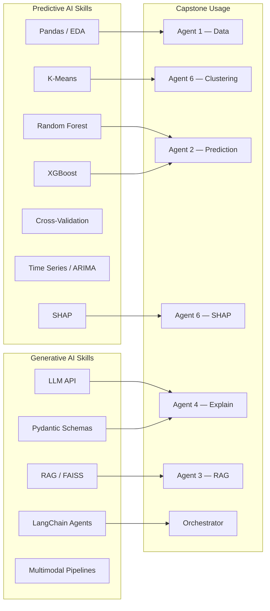

<div align="center">

# 🎓 Machine Learning & Generative AI — Lab Portfolio

[](https://www.python.org/)
[](https://jupyter.org/)
[](https://langchain.com/)
[](https://mistral.ai/)
[](https://streamlit.io/)

**M1 Internet of Things · Université Marie et Louis Pasteur, Montbéliard**
**Academic Year 2025–2026 · Supervisor: Prof. C. Guyeux**

[👤 GitHub Profile](https://github.com/AhmedAlmuharaq) · [🏥 Capstone Project →](https://github.com/AhmedAlmuharaq/medical-multiagent)

</div>

---

## 📌 Repository Overview

This repository documents the complete practical lab work for two modules: **Predictive AI** (classical ML) and **Generative AI** (LLMs, RAG, agents). All knowledge converges into one capstone project — a production-grade medical multi-agent system.

```
📦 TpsAHMED/
 ├── 🤖 IA prédictive AHMED/     Predictive ML  — TP1 to TP6
 ├── ✨ IA générative Ahmed/      Generative AI  — TP1 to TP5
 ├── 🏥 medical_multiagent/       Capstone project (copy)
 └── 📄 README.md
```

---

## 🗺️ Full Learning Map



---

## 🤖 Track 1 — Predictive AI

> Path: `IA prédictive AHMED/`

Six progressive labs covering the full supervised and unsupervised ML pipeline.

| Lab | Topic | Dataset | Key Methods | Results |
|-----|-------|---------|-------------|---------|
| **TP1** | Pandas & EDA | Iris (150 samples) | Filtering, feature engineering, visualisation | Clean pipeline, PetalRatio feature |
| **TP2** | K-Means Clustering | Mall Customers (200) | Elbow method, segment analysis | 5 customer segments identified |
| **TP3** | Classification | Breast Cancer (569) | Decision Tree, Random Forest, XGBoost | RF F1 = **93.9%** on malignant |
| **TP4** | XGBoost Advanced | Breast Cancer (569) | Early stopping, LR sweep, AUC/logloss | AUC ≈ **99.6%**, val monitoring |
| **TP5** | Regression & CV | California Housing (20k) | K-Fold CV, depth sweep, bias–variance | GradientBoosting best CV RMSE |
| **TP6** | Time Series (×4) | Bike Sharing (17k hrs) | Decomposition, ADF, ARIMA, ML forecasting | Daily peaks at 8h & 17–18h |

### TP6 Notebooks

```
TP6.1 → Exploration & Visualisation   (ACF/PACF, hourly/weekly profiles)
TP6.2 → Decomposition & Stationarity  (STL, ADF test, differencing)
TP6.3 → AR / ARIMA Modelling          (model selection, diagnostics)
TP6.4 → Supervised ML Comparison      (RF vs XGBoost vs ARIMA)
```

---

## ✨ Track 2 — Generative AI

> Path: `IA générative Ahmed/`

Five progressive labs covering the modern LLM stack, from first API call to multimodal pipelines.

| Lab | Topic | Key Technologies | Exercises Covered |
|-----|-------|-----------------|-------------------|
| **TP1** | Mistral API & Chains | `ChatMistralAI`, `ChatPromptTemplate`, `StrOutputParser` | Temperature comparison, token cost estimation |
| **TP2** | Structured Outputs | Pydantic, `with_structured_output` | Boolean, Enum, Integer score, Translation, Math steps |
| **TP3** | RAG & Vector DBs | FAISS, HuggingFace Embeddings, `RecursiveCharacterTextSplitter` | BoW → Transformers → cosine sim → full RAG pipeline |
| **TP4** | LangChain Agents | ReAct, Tavily, Wikipedia, arXiv, PythonREPL, custom tools | Multi-tool agents, cost comparison, multi-agent pipeline |
| **TP5** | Multimodality | OpenAI TTS, STT, Vision (gpt-4.1), image generation | Voice synthesis, transcription, visual analysis, full pipeline |

### TP3 RAG Pipeline



### TP4 Agent ReAct Loop



---

## 🏥 Capstone — Medical AI Multi-Agent System

> **[→ View Full Project on GitHub](https://github.com/AhmedAlmuharaq/medical-multiagent)**

A production-grade medical AI platform for **diabetes risk assessment**, combining XGBoost prediction, SHAP explainability, RAG medical knowledge retrieval, and LLM-generated clinical reports — all orchestrated by a LangChain router with persistent conversation memory.

### System Architecture



### The 6 Agents

| # | Agent | File | Role | Technology |
|---|-------|------|------|------------|
| 1 | **Data** | `agent1_data.py` | Load & preprocess patient data | pandas, scikit-learn |
| 2 | **Predict** | `agent2_predict.py` | Diabetes risk classification | XGBoost (~76–82% accuracy) |
| 3 | **RAG** | `agent3_rag.py` | Medical knowledge retrieval | FAISS + HuggingFace + Mistral |
| 4 | **Explain** | `agent4_explain.py` | Structured clinical explanation | Mistral API + Pydantic v2 |
| 5 | **Alert** | `agent5_alert.py` | Clinical risk alerts | Rule-based engine |
| 6 | **SHAP** | `agent6_shap.py` | Feature importance + clustering | SHAP + K-Means |

### Dataset

| Property | Detail |
|----------|--------|
| Name | Pima Indians Diabetes Dataset |
| Source | UCI / Smith et al., 1988 |
| Samples | 768 patients (Pima Indian women, age ≥ 21) |
| Features | Pregnancies, Glucose, BloodPressure, SkinThickness, Insulin, BMI, DiabetesPedigreeFunction, Age |
| Target | 0 = Non-diabetic / 1 = Diabetic (34.9% positive) |

### Dashboard Pages

| Page | Description |
|------|-------------|
| 🏠 **Dashboard** | Risk gauge, metric cards, 3-column alert layout |
| 📊 **SHAP Analysis** | Feature importance bar, patient waterfall, dependency scatter |
| 📚 **Medical RAG** | Semantic search over FAISS knowledge base + Mistral answers |
| 💬 **AI Chat** | LangChain multi-agent chat with conversation memory |
| 📈 **Dataset** | Statistics, class distribution, correlation heatmap |
| ℹ️ **Project Info** | Architecture diagram, agent timeline, roadmap |

### Quick Start

```bash
git clone https://github.com/AhmedAlmuharaq/medical-multiagent.git
cd medical-multiagent
pip install -r requirements.txt
echo "MISTRAL_API_KEY=your_key_here" > .env
streamlit run app.py
```

> The app works **fully offline** without an API key — XGBoost prediction, rule-based alerts, and SHAP all run locally. Mistral is only needed for RAG Q&A and LLM explanations.

---

## 🔗 Skills Coverage Matrix



---

## 🛠️ Tech Stack

<div align="center">

| Category | Tools |
|----------|-------|
| **Languages** | Python 3.10+ |
| **ML / Classical** | scikit-learn, XGBoost, statsmodels, SHAP |
| **LLM / Generative** | Mistral AI, OpenAI, LangChain, FAISS, HuggingFace |
| **Data** | pandas, NumPy, Pima Diabetes, Iris, Breast Cancer, California Housing, Bike Sharing |
| **Visualization** | matplotlib, Plotly, Streamlit |
| **Audio / Vision** | OpenAI TTS, Whisper, gpt-4.1 Vision, pydub |
| **DevOps** | Docker, python-dotenv, Pydantic v2 |
| **Notebooks** | Jupyter Lab / VS Code |

</div>

---

## 📁 Full Structure

```
TpsAHMED/
│
├── 🤖 IA prédictive AHMED/
│   ├── TP1/                         Pandas & EDA (Iris)
│   ├── TP2_Clustering/              K-Means (Mall Customers)
│   ├── TP3_Classification/          Decision Tree · RF · XGBoost
│   ├── TP4_XGBoost/                 Advanced XGBoost · Early Stopping
│   ├── TP5_Regression/              Regression · Cross-Validation
│   └── TP6_Series_Temporelles/      Time Series (4 notebooks)
│
├── ✨ IA générative Ahmed/
│   ├── TP1/                         Mistral API · Chains
│   ├── TP2/                         Structured Outputs · Pydantic
│   ├── TP3/                         RAG · FAISS · Embeddings
│   ├── TP4/                         LangChain Agents · Tools
│   └── TP5/                         Multimodality · TTS · Vision
│
└── 🏥 medical_multiagent/           ← Capstone (local copy)
    ├── agents/                       6 specialised agents
    ├── orchestrator.py               LangChain router
    ├── app.py                        Streamlit dashboard
    ├── data/                         Dataset + cached models
    └── knowledge_base/               Medical PDFs for RAG
```

---

## 👥 Authors

<div align="center">

| | Name | Program | Links |
|--|------|---------|-------|
| 👤 | **Ahmed Almuharaq** | M1 IoT | [GitHub](https://github.com/AhmedAlmuharaq) · [LinkedIn](https://www.linkedin.com/in/almuharaqa/) |
| 👤 | **Malick Diop** | M1 IoT | Université Marie et Louis Pasteur |

**Supervisor:** Prof. C. Guyeux
**Institution:** Université Marie et Louis Pasteur, Montbéliard, France
**Year:** 2025–2026

</div>

---

<div align="center">

*Developed for academic purposes as part of the M1 IoT curriculum.*
*All lab work is original and completed individually unless stated otherwise.*

</div>
